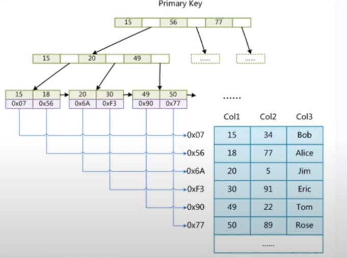
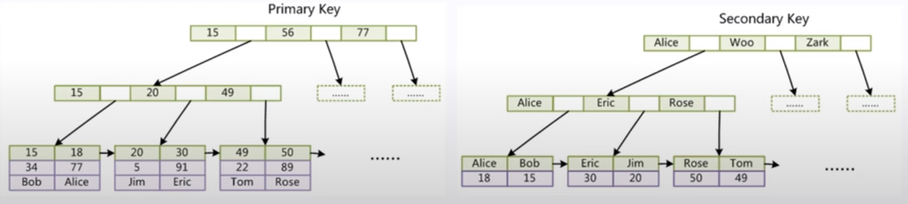
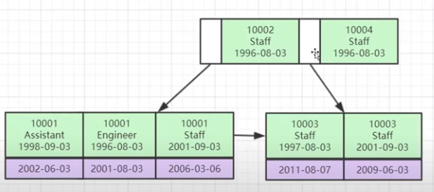

* [存储引擎](#存储引擎)
* [索引优化原则](#索引优化原则)
* [其他](#其他)
* [索引CRUD](#索引crud)


*******************************************************************************
*******************************************************************************


# 存储引擎
* **InnoDB(聚集索引, cluster index)** 索引和数据(.idb)存在一起
    - innodb.frm: 表结构
    - innodb.idb: 数据与索引, 叶子节点存储对应记录的其他数据
* **MyISAM(非聚集索引)** 索引(.MYI)和数据(.MYD)分开存放
    - myisam.frm: 表结构
    - myisam.MYD: 数据
    - myisam.MYI: 索引, 叶子节点存储对应记录所在.MYD位置的指针





# 索引优化原则
1. **全值匹配**
2. **最左前缀匹配** 从索引的最左前列开始且不跳过索引中的列
3. **不在索引列做任何操作** 比如计算, 函数, 类型转换
4. **范围条件放在最后:** 要范围查询的字段在创建索引时放在最后
5. **尽量使用覆盖索引**
6. **不要用不等于(!=):** 使用不等于会导致全表扫描
7. **NULL/NOT有对索引影响**
8. **注意LIKE:** 通配符(%)开头会变成全表扫描
9. **字符类型加引号** 字符串不加单引号索引失效
10. **UNION效率高**

# 其他
* InnoDB表必须要有主键
* innodb非叶子节点不存储数据
* 数据即索引, 索引即数据
* 一个节点16KB(innodb_page_size) `SHOW VARIABLES LIKE 'innodb_page_size';`
* 有hash索引(范围查询性能差), 也有b tree索引
* 为何是B+树
    - **二叉查找树:** 递增数据变成链表, 高度太高
    - **二叉平衡树(AVL):** 高度太高
    - **红黑树:** 可以自动平衡, 但是一个节点只能存储一个数据, 高度还是太高
    - **B树:** 非叶子节点存储数据; 一个节点可以存储多个数据, 但范围查询性能太差
    - **B+树:** 非叶子节点不存储数据, 数据有冗余
* 索引分类
    - 普通索引
    - 唯一索引
    - 复合索引
    - 联合索引

# 索引CRUD
```sql
-- 新建索引
INDEX index_name (column_name(length)),

-- 增加索引
ALTER TABLE table_name ADD INDEX index_name(column_name)

-- 删除索引
DROP INDEX [index_name] ON table_name;

-- 查看索引
SHOW INDEXS FROM table_name\G;
```
